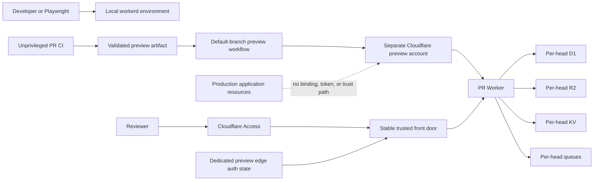

# Local and PR environment redesign

Status: proposed

This plan replaces the shared preview environment and the manual local setup. It does not change production data or deploy code by itself.

## Outcome

The finished workflow has four supported paths:

| Need | Command contract | Authentication |
|---|---|---|
| Run the hub locally | `npm --prefix hub run dev:up` | None. The server binds to loopback and uses isolated local state. |
| Run browser tests | `npm --prefix hub run test:e2e` | None. The harness creates, migrates, seeds, starts, tests, and removes its own environment. |
| Open a PR preview | `npm --prefix hub run preview:open -- --pr <number>` | The shortcut opens the stable front door. Cloudflare Access handles user consent; no SQL or Wrangler login is required. |
| Debug a production session | `sessions-dev-bridge pull --session <id> --target local\|pr-<number>` | A signed bridge installed outside the checkout opens the production and destination approvals. Transport is encrypted to the approved destination. |

The same Playwright project runs against the local server on Windows and Linux, and against the deployed PR URL after preview deployment.

## Why the current preview should be replaced

The existing controls prevent several accidents, but the environment model is the source of the remaining problems.

- `hub/wrangler.jsonc` binds every branch to one long-lived `sessions-index-preview` D1 database. An unmerged migration changes the schema for every branch. A branch can therefore run against a schema ahead of or incompatible with its own migration set.
- Pull request migrations use a second migration engine in `hub/src/api/migrate.ts`. It has its own SQL scanner and accepts a smaller subset than Wrangler. The job can also finish green after the branch endpoint remains unreachable, leaving deployed code on an old schema.
- Applied D1 migrations are identified by filename, not content hash. `hub/migrations/0020_priced_version_not_null.sql` records a real correction after preview had already applied an older version of `0019`.
- `npm --prefix hub run dev` does not migrate local D1. Local setup, tests, and deployed environments reach schema readiness through different paths.
- `scripts/seed-local.mjs` uploads the operator's real corpus. There is no small deterministic browser fixture or lifecycle-managed local database.
- CI runs Vitest and Python tests only on Ubuntu. There is no Playwright dependency, browser installation, Windows job, server readiness contract, or browser artifact upload.
- Browser access to preview requires a manually generated nonce and a hand-written D1 query. `hub/src/viewer/preview-auth.ts` then sets the preview cookie to the long-lived shared `DEV_AUTH` value. The same secret also authorizes machine API access as an admin identity.
- Preview and production use the same Cloudflare account. A PR controls its Worker code and Wrangler configuration. It can replace the preview D1 or KV IDs with the committed production IDs and remove the in-Worker marker check. The production KV session format in `hub/src/auth/session.ts` accepts an opaque `sess:<token>` record without an environment issuer or MAC. A malicious preview bound to production KV could write a chosen production viewer session.
- The repository's `main` branch is currently unprotected. A writer can bypass review and run the main deployment job with the production token.

D1 and Workers Scripts write permissions are account-scoped. Calling a token "preview-only" does not stop it from naming production resources in the same account. A separate Cloudflare account is the security boundary. An in-Worker marker remains useful for mistakes, but it cannot be the boundary because the PR controls the check.

## Decisions

1. Put every PR resource in a dedicated Cloudflare non-production account. That account contains no production D1, R2, KV, Queue, Worker secret, custom domain, OAuth broker, certificate authority access, or observability credential.
2. Stop using Workers Builds for branch deployment. A trusted workflow from the default branch provisions and deploys a complete environment only after unprivileged CI passes.
3. Create an immutable resource generation for each PR head. Do not migrate one shared preview database forward.
4. Keep `hub/migrations` as the only schema source and use Wrangler as the only remote migration executor. Remove the custom migration endpoint after cutover.
5. Reproduce sessions by exporting selected R2 source objects and replaying the normal ingest path. Never clone production D1 or KV.
6. Split human browser login, machine import, and Cloudflare administration into separate capabilities. Remove the shared `DEV_AUTH` bearer.
7. Implement orchestration in Node with argument arrays and explicit process handling. Do not put Bash, PowerShell, `curl`, `jq`, or SQL snippets in the normal developer path.
8. Keep production's migrate-before-deploy ordering. The redesign narrows its token and strengthens the GitHub gate; it does not recreate production.

## Target environment model



### Resource generations

Use one PR prefix, a stable Worker name owned by the PR, and a collision-proof generation ID derived from the trusted GitHub run ID plus at least 12 SHA characters:

- PR prefix: `pr-<number>-`
- stable Worker: `pr-<number>-sessions-hub`
- generation: `g<run-id>-<sha12>`
- D1: `pr-<number>-<generation>-sessions-index`
- R2: `pr-<number>-<generation>-agent-sessions`
- KV: `pr-<number>-<generation>-sessions-hub-kv`
- queues: `pr-<number>-<generation>-parse` and `pr-<number>-<generation>-parse-dlq`
- public host: `pr-<number>-preview.sessions.vza.net`

The stable Worker is owned by the PR number and is reused across heads. Generation resources are owned by full SHA and run ID. The allocator checks every Cloudflare naming limit and verifies existing typed resources against trusted ownership records. A retry of the same run resumes the last recorded phase for its generation; a new run gets a new generation. It never guesses ownership from a partial name.

The workflow records the full SHA, run ID, attested Worker artifact digest, resource IDs, creation time, schema digest, uploaded Worker version, and smoke result in trusted state. PR files may supply application source and SQL migration content. They may not supply account IDs, resource IDs, routes, Worker names, secrets, lifecycle scripts, build configuration, or the generated Wrangler configuration.

The front-door Durable Object is the sole routing authority. For each PR it stores one strongly consistent state record: lifecycle status and epoch, expected head SHA, live tuple, optional candidate tuples, rollback tuple, and deletion inventory. Each tuple carries generation ID, exact immutable Worker version URL, full head SHA, attested artifact digest, and schema digest. The public host resolves through the live tuple rather than through whichever version Cloudflare marks deployed on the Worker service.

Serialize deployment and cleanup with one concurrency group per PR. For each new head:

1. Unprivileged PR CI runs type checks, unit/integration tests, migration checks, and local Playwright on the PR checkout.
2. After CI succeeds, a default-branch `workflow_run` build job checks out that exact head with no persisted GitHub token, Cloudflare credential, environment secret, or write permission. A default-branch build driver uses pinned tool versions, ignores package lifecycle scripts, resolves no PR build config, and runs in a sandbox with no network after dependency acquisition.
3. The hermetic job emits only the bundled preview Worker, static assets if any, migration SQL, and separate canonical build, migration, and content manifests. It computes the bundle digest and emits build provenance binding that digest to repository, head SHA, trusted workflow identity, toolchain digest, and run ID.
4. A separate credentialed control job verifies the provenance and artifact digest before reading the artifact as untrusted data. It rejects path traversal, links, unexpected files, oversized entries, manifest mismatches, and any source other than the successful hermetic job. If a dependency change cannot build under this contract, update the trusted toolchain on `main` first rather than executing PR lifecycle code beside credentials.
5. Trusted orchestration confirms the PR is open and the attested SHA is still the current PR head, then creates a new generation in the non-production account and writes a generated Wrangler config under a temporary directory.
6. Pinned Wrangler from the default branch applies all migrations to the new D1 and reports zero pending migrations.
7. The workflow uploads the attested immutable Worker version with `wrangler versions upload` or an equivalent fixed API call. It does not deploy that version to the stable Worker.
8. The front door registers a candidate tuple through a one-use, generation-bound CI grant. Candidate registration is a CAS requiring lifecycle status `open`, the expected epoch and head SHA, and no newer generation. Candidate routing targets only the exact version URL, injects the origin assertion, and never changes the live tuple. The workflow waits for candidate readiness, seeds synthetic data through that candidate's normal upload and queue path, then runs remote Playwright through the Access-protected candidate route.
9. Smoke verifies the generated bindings, head SHA, artifact digest, schema digest, synthetic data, and direct-origin denial.
10. Immediately before promotion, orchestration rechecks the open PR's current head and artifact digest. The front door atomically compare-and-swaps the candidate into the live slot only if lifecycle status is still `open` and epoch, expected head SHA, expected candidate generation, and prior live tuple all match. That single state write is the promotion; there is no second Cloudflare service-promotion step that can diverge. A stale run cleans up its own generation and cannot overwrite a newer head.
11. The previous routing tuple, Worker version, and resource tuple remain intact through the rollback window. Rollback is one front-door tuple CAS subject to the same open status, epoch, and head checks. Older versions and resources are then deleted.

Close is a competing atomic front-door transition, not only a workflow convention. It increments the epoch, writes a permanent closed tombstone, moves live, candidate, and rollback resource references into the deletion inventory, and clears every routable tuple before returning resources for deletion. Candidate registration, promotion, and rollback all reject a tombstone. The PR-close workflow still shares the per-PR concurrency group, but correctness does not depend on GitHub scheduling.

No Cloudflare credential enters a job that executes PR package scripts, PR actions, PR configuration, or the bundle build. Before enabling the credentialed upload, prove that pinned Wrangler with the generated config and prebuilt artifact performs no artifact-code execution. If it does, use the Cloudflare REST API or a fixed uploader instead.

### Cleanup

A default-branch `pull_request_target` close workflow executes the atomic close transition, then deletes the returned inventory. It never checks out the PR. A scheduled janitor independently removes:

- deletion-inventory resources for closed PRs;
- failed or canceled generations older than 24 hours;
- superseded generations outside the rollback window;
- stable Workers whose trusted state has a closed tombstone and no matching open PR.

Deletion treats not-found as success. For every typed resource ID, cleanup verifies the expected resource kind, exact recorded name, common `pr-<number>-` prefix, and generation ownership before deletion. Janitor cleanup for an open PR preserves its live and rollback tuples. Tests cover every Worker version, D1, R2, KV, and both queues; partial retries; foreign-name rejection; and both orderings of a close-versus-promotion race. Exactly one transition wins, and a completed close always leaves no routable tuple.

## D1 lifecycle and migration policy

### One runner, three targets

Create `hub/scripts/environment.mjs` as the command entrypoint and small testable modules under `hub/scripts/lib/`. It owns these modes:

- `local`: use an explicit `--persist-to` directory under `.dev/local/<name>`;
- `e2e`: use a fresh temporary persistence directory and port;
- `preview`: use the trusted generated remote config;
- `production`: retain the main-only migrate-before-deploy workflow.

The sequences differ only where a running HTTP path is required:

- local/e2e: validate migration and build manifests, apply, verify, start, wait for readiness, seed through normal ingest, then probe indexed data;
- preview: validate, apply to the new D1, upload the exact version, register the candidate route, wait for readiness, seed through the candidate's normal ingest, smoke, then promote the tuple;
- production: validate, apply and verify migrations, deploy, then smoke without seeding.

A missing table should never be the first indication that setup was incomplete.

### Migration invariants

- Existing migration files are immutable. A PR may add a later `NNNN_name.sql`; it may not edit, remove, reuse, or reorder a migration already present on the base branch.
- Keep the intentional `0004` gap reserved. Validate unique numeric prefixes and filenames.
- A signed release manifest records the ordered filename and SHA-256 for every new migration. A trusted deployment journal records intended artifact digest, migration hash, and phase before Wrangler runs.
- A checksum table created by a new migration records authoritative hashes for migrations first deployed after the ledger exists. Recording is a crash-safe state machine: intended, Wrangler-applied, checksum-recorded, committed. Reconciliation is allowed only against the same immutable artifact and journal. A disposable preview with ambiguous state is destroyed and recreated.
- Do not backfill historical production hashes from current files. Reconstruct exact bytes from Git history, deployment evidence, and backups. The known `0019` divergence must remain explicit. If any historical bytes cannot be proven, fail closed, verify normalized live schema and data invariants, and create a separately signed, human-approved production baseline. Mark unknown history as baselined, not hash-verified.
- Test crash and retry at every phase, partial baseline, wrong artifact, changed filename bytes, clean install from `0001`, and base-schema upgrade with representative data.
- Run the migration command twice and require zero pending work on the second run.
- Compare normalized `sqlite_master`, relevant PRAGMAs, FTS tables, migration ledger, and schema digest between clean and upgrade databases.
- Keep migrations forward-only after they have reached any persistent environment. A correction gets a new migration.
- Use application reindexing for fields that SQL cannot derive from R2. Do not hide required reindex work inside a schema assertion.

After the separate account path is live, remove `hub/src/api/migrate.ts`, its route and environment variables, the preview marker table, the custom SQL splitter, `migrate-preview`, `migrate-preview-main`, and their custom tests. Standard migration behavior then comes from pinned Wrangler everywhere outside Miniflare tests.

### Drift gates

A successful environment reports:

```json
{
  "environmentId": "local-name or pr-number/full-sha",
  "codeSha": "full git sha or dirty-worktree marker",
  "buildInputDigest": "sha256 of the canonical declared inputs",
  "artifactDigest": "sha256 of the actual local or attested Worker bundle",
  "migrationDigest": "sha256 of ordered migration names and hashes",
  "schemaDigest": "sha256 of normalized live schema",
  "pendingMigrations": 0,
  "seedDigest": "fixture or debug bundle digest"
}
```

Expose this on an authenticated development diagnostics route and include it in deployment logs. Production deployment checks the live migration names and checksums before code deploy. Preview smoke checks that the response matches the artifact SHA and schema digest, so a stale Worker or stale database cannot pass.

## Local development and Playwright

### Local process contract

`dev:up` must:

1. check Node, npm, Wrangler, and the selected port;
2. create or reuse the named loopback-only persistence directory;
3. generate an environment nonce and record its process start identity;
4. generate canonical, separately hashed build-input, migration, and seed manifests; the build manifest contains only the dependency lockfile, trusted config, and transitive source inputs reported by the pinned bundler in canonical relative-path order;
5. reject symlinks escaping the repo and exclude `.env*`, credentials, private corpus files, `.dev`, `node_modules`, caches, ignored output, and unrelated untracked files; include a dirty file only when the bundler proves it is consumed;
6. acquire an environment ownership lock;
7. build twice and require the declared input manifest to reproduce the same bundle digest;
8. apply and verify migrations;
9. start Wrangler with `ENVIRONMENT=development` and explicit host/port/persistence arguments;
10. wait for `/healthz` and environment diagnostics carrying the same nonce, build-input digest, artifact digest, migration digest, and schema digest;
11. print the URL and state directory;
12. remain in the foreground, forward Ctrl+C, and terminate the owned process tree on Windows and Linux.

Do not provide a PID-only `dev:down`. The foreground owner or Playwright harness owns process teardown. `dev:reset` resolves and prints the selected path, rejects anything outside `.dev/`, and refuses while the environment lock or matching live nonce is present. Tests cover a stale PID, PID reuse, reset while running, a stale lock after a crash, and path traversal.

Replace the real-corpus default with a small synthetic fixture checked into the existing test fixture area. Keep `scripts/seed-local.mjs` as an explicit private-data tool, renamed or wrapped as `session:seed-corpus`, with a schema-readiness probe and a warning that it uploads local transcripts.

### Playwright contract

Add `@playwright/test`, `hub/playwright.config.ts`, and browser tests under `hub/e2e/`. The default command starts its own isolated local environment. `BASE_URL` switches the same tests to a deployed preview without starting a local server.

Initial browser coverage should prove observable behavior that Vitest cannot:

- health and first page load;
- synthetic upload reaches the queue/parser and becomes searchable;
- search result navigation renders the expected session and turn anchors;
- filter and pagination query state survive navigation;
- star/unstar performs the same-origin POST and updates after reload;
- blob and asset subresources load under the browser cookie policy;
- unauthenticated preview redirects or denies;
- a one-time preview login works once, sets an environment-scoped session, and cannot be replayed;
- a preview session/cookie is rejected by production and by another PR environment.

Run Chromium on `ubuntu-latest` and `windows-latest` with Node 22. Linux installs Chromium with system dependencies; Windows installs Chromium only. Use one database per run and one Playwright worker until mutating fixtures are namespaced. On failure, upload the full Wrangler log, Playwright trace, screenshot, video, environment manifest, and schema diagnostics. Never upload a production debug bundle.

The remote smoke job runs only after deployment and uses synthetic data. Fork PRs still run local Playwright; remote deployment can be limited to trusted PRs until the preview workflow's artifact boundary is verified.

## Preview authentication

Browser review, machine import, and infrastructure management need different credentials.

### Browser login

Terminate browser authentication at the stable front door, before any request reaches PR code. Put a Cloudflare Access application on `*-preview.sessions.vza.net` and restrict it to the owner's GitHub identity. The front door validates the team-domain issuer, Access application audience, signature, expiry, and allowed identity.

`preview:open` only resolves the PR's current healthy URL and opens it. The agent can run the command, while the user's existing Access browser session or GitHub login completes consent. There is no Wrangler login, D1 write, copied bearer, or repository skill in this path.

Remote Playwright cannot receive a reusable Access service token. The trusted default-branch workflow exchanges an exact GitHub OIDC identity for a one-use edge grant bound to repository, trusted `job_workflow_ref`, PR number, head SHA, run ID, audience, actor, `jti`, and a short expiry. A dedicated front-door Durable Object stores grant consumption and short edge sessions.

The bootstrap route is implemented by the immutable front door, not the PR Worker. It consumes the code without forwarding the code or query string, sets `Cache-Control: no-store` and `Referrer-Policy: no-referrer`, and creates a random `HttpOnly; Secure; SameSite=Strict; Path=/` edge cookie. The cookie is host, PR, head SHA, audience, and expiry bound.

The front door does not copy request or response headers. It constructs requests from a versioned safe-header allowlist needed by the application, such as validated content type, content length, range, conditional cache headers, and a synthesized same-origin `Origin` for state-changing requests. It drops every cookie, authorization header, `cf-*`, forwarded/proxy header, Access field, browser bootstrap field, and unknown header. Response headers use a separate content/cache/range/rewritten-location allowlist; every `Set-Cookie` and unknown header is dropped. Sentinel tests send unknown and future-looking credential headers in both directions and prove none crosses the boundary.

After Access or an edge session succeeds, the front door mints a short-lived browser request assertion with a distinct audience. It binds actor, identity kind `human`, PR, head SHA, method, the exact canonical request target (`pathname` plus query), mutation body digest when present, issued-at, expiry, and `jti`. The front door rejects malformed percent encodings, encoded separators, and duplicate security-sensitive selectors; mutations place the selected resource in the path or digested body rather than query-only state. The Worker compares the assertion to the exact forwarded target and verifies it with a public key before viewer actions such as star/unstar. Raw Access and browser credentials never cross the boundary.

Use a separate per-generation origin assertion between the front door and the PR Worker. The Worker denies its direct `workers.dev` origin without that assertion. A hostile PR can disclose its own verifier or remove the check and can read all data the user explicitly copied into that PR, so user consent must name the exact head SHA. The control prevents accidental public access, not hostile code from seeing data intentionally given to that code. Remote production-session import remains disabled until tests prove direct-origin denial and request/response credential stripping.

Remove `DEV_AUTH` from browser cookies, asset signing, and Worker bindings. Remove `meta.preview_auth:*`. Preview routing must not call the production KV `readSession` path.

### Machine and test access

Do not bind a reusable machine or admin secret to PR code. Synthetic seed, remote smoke setup, and debug import each begin as a one-use action grant in the trusted front-door Durable Object. This assertion uses a different key and audience from browser requests. The grant binds method, exact canonical request target, PR, head SHA, body digest or object manifest, byte limit, actor, purpose, expiry, and `jti`; it uses the same malformed-encoding and duplicate-selector rejection rules. After consuming it, the front door forwards that exact target with a short signed assertion. The PR Worker receives only public verification material and the already-consumed assertion, never a root signing key, Cloudflare credential, or reusable machine bearer.

Production ignores every preview edge session, origin assertion, and action grant. Preserve the `ENVIRONMENT` allowlist and `src/preview.ts` module-surface test.

### Production viewer session hardening

Account separation is the main boundary. Also make production KV sessions fail closed if storage is ever misbound. Store a versioned, authenticated envelope with issuer, audience host, environment, user, issued-at, absolute expiry, and a random session ID. Sign it with a production-only session key that is distinct from asset signing and setup secrets. Validate the schema, MAC, exact production issuer/audience/environment, and absolute expiry on every read; KV TTL is cleanup, not authorization.

Add negative tests for unsigned or modified records, malformed JSON, expired records, wrong host, wrong environment, and preview-to-production or production-to-preview replay. A production viewer session is never accepted in preview, even if an identical KV record exists.

## Production session replication

Do not copy a D1 database. D1 contains WebAuthn credentials, challenges, machine certificate state, admin flags, alerts, and derived indexes. KV contains live viewer sessions. None belongs in preview.

### Portable debug bundle

Add a versioned bundle containing only source objects needed to reconstruct the selected session:

```json
{
  "format": 1,
  "sessionId": "selected session",
  "exportedAt": "timestamp",
  "objects": [
    {
      "store": "source store",
      "relpath": "safe relative path",
      "size": 123,
      "sha256": "content digest",
      "sessionIds": ["ids expected after parse"]
    }
  ]
}
```

The archive includes the manifest and R2 object bytes. Resolve objects from the session's canonical file and every distinct `blocks.file_id`; include related sessions only when the user selects their exact IDs. Traverse normalized `externalAsset` references and include each bounded asset file row and R2 object.

By default, the exporter emits a sanitized, harness-valid raw object containing only the selected session and round-trips it through the real parser. If lossless isolation is unavailable, stop and require explicit selection of every session in the shared object. The consent page lists each exact session ID, title, and byte count. The manifest carries that allowlist. Import parses into isolated staging state and refuses promotion if any unapproved session ID appears.

The importer verifies archive shape, version, hashes, total and per-file size limits, relative paths, allowed stores, duplicate keys, asset references, approved session IDs, and expected parse results. It assigns a synthetic non-admin machine identity and replays the existing upload, R2, queue, parser, D1, and FTS path. Direct SQL import is prohibited.

Explicitly exclude:

- D1 `credentials`, `webauthn_challenges`, `meta`, `machines`, `retired_certs`, and `alerts` rows;
- KV entries, especially `sess:*`;
- machine certificates, private keys, admin state, setup tokens, asset-signing secrets, and OAuth broker state;
- queue messages and observability credentials;
- unrelated R2 objects.

### User-mediated production grant

The production-data client is a standalone `sessions-dev-bridge`, built and signed only by a protected default-branch release workflow and installed outside any repository checkout. It verifies its release provenance at startup and refuses to load code, configuration, plugins, or lifecycle hooks from the target repo. A repository package script is not an authorization client.

`sessions-dev-bridge enroll` creates the local-attestation device key in a non-exportable OS keystore, using TPM-backed Windows CNG or a Linux TPM2/PKCS#11 provider. If the platform cannot provide a non-exportable key, local production-data import stays disabled and the user can target an Access-protected remote preview instead. Enrollment opens production in the browser and requires a fresh passkey assertion over the exact bridge signing public key, device label, bridge release digest, user, `local-destination-attest` scope, and expiry.

Production stores only the public key and enrollment metadata. Local attestations include the bridge release provenance, device ID, monotonic counter, `jti`, issued-at, and short expiry. Production checks signature, scope, approved release, counter, replay, expiry, and revocation before snapshot preparation. Rotation enrolls the new key before revoking the old key; the production settings page supports immediate passkey-confirmed revocation. Tests cover wrong release, wrong scope, modified destination, duplicate counter or `jti`, expired enrollment, revoked device, and exported/software-key fallback.

For a local target, the bridge invokes its embedded pinned build driver, not a repository command. It derives the canonical transitive input manifest, displays every consumed dirty or untracked path for consent, builds twice, and requires a reproducible bundle digest. It rejects caller-supplied artifacts, digests, configuration, lifecycle hooks, and symlinks outside the checkout. The bridge then creates an immutable build snapshot, generates a one-use encryption key, and owns the launched environment. Its registered device key signs a destination attestation containing the environment nonce, build-input and artifact digests, encryption public key, inventory placeholder, expiry, and `jti`. The bridge never signs caller-supplied fields. The private key remains in the bridge process and the bridge streams decrypted objects directly into the exact environment it launched.

For a remote target, the bridge resolves the current routing tuple from the trusted front door rather than accepting it from checkout code. Before production releases bytes, the user approves the exact PR, head SHA, attested Worker artifact digest, and size ceiling through Cloudflare Access. The front-door Durable Object creates the destination encryption key and returns a signed, one-use destination attestation. The private key remains at the front door.

The bridge then starts an exact `127.0.0.1` loopback callback with a PKCE challenge and opens a preliminary production authorization page with the independently signed destination attestation. An existing production browser session and explicit user confirmation authorize preparation for that exact session and destination.

Production validates the destination attestation, returns a one-use PKCE-bound prepare code to loopback, and enqueues an asynchronous snapshot job with per-user concurrency, byte, and rate quotas. The bridge exchanges the code and polls with an opaque job capability. Polling returns no session metadata before authorization, uses non-enumerating errors, and cannot select a different session or destination.

The job resolves source and external-asset objects, copies their exact bytes to short-lived immutable export objects, and computes an inventory of snapshot object IDs, sizes, and hashes. The destination extends or reissues its attestation for that inventory digest. The final production confirmation page renders the snapshot's session ID, title, byte size, object count, inventory digest, destination environment, destination head and artifact digest, and expiry. Production requires exact-origin CSRF protection and a fresh passkey challenge whose server-side state binds the inventory and destination attestations. Send `Content-Security-Policy: frame-ancestors 'none'`, `X-Frame-Options: DENY`, `Cache-Control: no-store`, and `Referrer-Policy: no-referrer` on every prepare, consent, polling, and callback response.

Final approval consumes the passkey challenge and creates a single-use authorization code bound to:

- `session:export:<exact-session-id>`;
- the immutable snapshot inventory digest and total size;
- the signed destination attestation, encryption public key, environment nonce, head SHA, and artifact digest as applicable;
- the loopback PKCE challenge;
- a short expiry and unique `jti`.

Production encrypts every snapshot object to the destination public key before exchange. The bridge receives and verifies only ciphertext plus the signed manifest. It has no production viewer token and no general search capability. Snapshot objects expire and are deleted after exchange or grant expiry.

For local import, the trusted bridge decrypts directly into the immutable environment it owns, after rechecking its nonce and artifact digest. For remote import, the bridge uploads ciphertext to the front door; the Durable Object rechecks the live routing tuple and destination attestation, decrypts, and forwards one-use digest-bound import assertions to the exact Worker version. The Worker checkpoints upload and parse progress, and the bridge polls the asynchronous job until the session and assets are indexed. Checkout code and the transport path never receive a reusable credential or plaintext bundle before the approved destination.

Default to local import. Remote import requires the trusted-front-door and direct-origin auth checks, both user confirmations, an unchanged live routing tuple, and automatic deletion with the PR environment. Never commit, cache in CI, or upload plaintext or ciphertext bundles as GitHub artifacts.

## Cloudflare and GitHub trust boundaries

### Account split

Create a new Cloudflare account for ephemeral development. The provisioning script hard-fails if its account ID equals production `18ef3246e9f36d1560485ef53889c0ab`. It also rejects the production resource names and IDs in any generated preview config.

Keep the stable `*-preview.sessions.vza.net` front door in the production account because the zone lives there. Its only stateful binding is a dedicated preview-edge-auth Durable Object. It has no production application D1, R2, KV, Queue, OAuth broker, session key, or other production application secret. Its preview-only cryptographic state consists of separate edge-session, browser-assertion, action-assertion, and control keys plus one-use destination encryption keypairs.

Front-door private keys are available only to protected front-door code. Give each key type a distinct audience and key ID. Rotate signing keys on a fixed schedule with a bounded prior-key verification window; delete per-destination private keys immediately after import or expiry. Audit issuance, rotation, use, replay rejection, and deletion by key ID without logging key material. Tests prove one key class cannot sign for another and that expired, revoked, or deleted keys fail.

### GitHub controls

Enable a repository ruleset for `main` before moving credentials:

- changes enter through pull requests;
- require `actions-lint`, Hub tests, collector tests, client tests, and local Playwright;
- block force pushes and branch deletion;
- require conversation resolution;
- require an owner review for workflow, Wrangler, migration, and `infra/cf` changes when another writer is added.

Put production credentials in a protected GitHub `production` environment. Put non-production control credentials in a separate `preview-control` environment used only by default-branch `workflow_run`, close cleanup, and janitor workflows. A PR workflow never receives either credential.

The front door accepts routing CAS, close tombstones, janitor changes, and CI grant minting only through distinct GitHub OIDC control endpoints and audiences. Each endpoint pins issuer, repository, exact default-branch `job_workflow_ref`, event/ref class, operation, PR/head/run where applicable, expiry, and a unique `jti` consumed in the Durable Object. Deploy, close, and scheduled janitor use separate audiences and claim policies. These calls carry no production Cloudflare API token, Access service token, or application credential.

Split the current combined production token into at least:

- D1 migration token: production account, D1 Edit only;
- Worker deploy token: production account, Workers Scripts Edit plus only the empirically required existing-binding and `vza.net` route permissions;
- log reader: Workers Tail Read only, outside deploy CI.

Use account-owned service tokens for CI rather than Pedro's user token. Add TTL/rotation and record the exact permission group IDs, not only dashboard labels.

## Minimum Wrangler permissions

Local development and local Playwright require no Cloudflare authentication.

For interactive work, provide scripts instead of asking the agent to construct a token:

- `npm --prefix hub run preview:open -- --pr <number>` needs no Wrangler scope. It opens the Access-protected stable front door for user-mediated preview login.
- Production session export uses the application PKCE grant, not Wrangler.
- `npm --prefix hub run auth:preview-admin` is an exceptional infrastructure flow, not a development prerequisite. It may use scoped OAuth only for a dedicated Cloudflare identity whose complete membership list contains the non-production account and not production. Otherwise it requires a short-lived account API token restricted to the non-production account. The script fails if `whoami` reports production or any second account.
- The candidate preview-admin OAuth set is `account:read user:read workers:write workers_scripts:write workers_kv:write d1:write queues:write`. Wrangler exposes no R2-specific OAuth scope, so the sacrificial-resource test must determine which overlap is unavoidable before freezing the profile.
- Log access is not part of routine development. Non-production tail work requests only `account:read user:read workers_tail:read` through a nonprod-only identity or account-restricted short-lived token and revokes it after the session. Production tail requires separate explicit approval, a Worker-specific operational procedure, and never runs from a PR checkout.

Wrangler 4.111.0 requests every OAuth scope when `login` is run without `--scopes` and stores OAuth tokens in plaintext unless keyring storage is enabled. Every OAuth `login`, `whoami`, and resource command runs with `CLOUDFLARE_AUTH_USE_KEYRING=true`. The scripts fail when Windows Credential Manager or Linux libsecret is unavailable, verify `whoami` reports encrypted/keyring-backed storage, and refuse to continue while a plaintext credential file exists for that profile. Selecting a non-production account in a multi-account user profile does not constrain OAuth authority and is not an acceptable boundary.

For the trusted preview CI account token, start with this resource-restricted set on the non-production account:

| Operation | API token permission |
|---|---|
| Create/delete/migrate D1 | D1 Edit |
| Upload/delete Worker, versions, secrets, schedules | Workers Scripts Edit |
| Create/delete KV | Workers KV Storage Edit |
| Create/delete R2 | Workers R2 Storage Edit |
| Create/delete queues | Queues Edit |
| Resolve account | Account Settings Read |

No zone permission is needed because the stable front door is provisioned separately. D1 Edit and Workers Scripts Edit still cover every such resource in the selected account, which is why account separation is mandatory.

Cloudflare does not publish a complete command-to-permission table. Before freezing the token, test one sacrificial generation while removing one permission at a time. Record the failing API URL and error for D1 create/delete/list/apply, Worker upload/deploy/delete, version secrets, KV, R2, Queues, and workers.dev configuration. Reduce Edit to Read wherever creation or deletion does not require Edit. The resulting tested matrix becomes a short comment beside the workflow secret.

## Implementation sequence

### 1. Guard production first

- Create the non-production Cloudflare account and workers.dev subdomain.
- Enable the `main` ruleset and GitHub `production` and `preview-control` environments.
- Create separate account-owned tokens and verify their scopes with sacrificial resources.
- Create an encrypted, access-controlled production D1 export on an operator-owned local volume and record current Worker versions before changing deployment automation. Never place the export in CI, a repository, logs, or a GitHub artifact. Retain it only through cutover verification, then securely remove it according to the workstation's encrypted-storage procedure.
- Authenticate production viewer session records with a production-only key and make preview routing skip the production session reader.

Gate: a process holding the preview token cannot list, read, mutate, or name any production account resource. A PR job has no Cloudflare secret. Forged, expired, or cross-environment KV session records fail.

### 2. Build the local environment command

- Add the Node environment orchestrator and explicit local persistence directories.
- Make migration, readiness, seed, reset, and process cleanup one flow.
- Add the deterministic synthetic fixture through the normal ingest path.
- Fix or remove `verify-corpus.mjs`'s unused SQLite discovery contract.

Gate: a clean checkout reaches a searchable local session with one command on Windows and Linux. Running it twice is idempotent. Reset cannot remove anything outside `.dev/`.

### 3. Make migrations reproducible

- Add filename and immutability checks, signed release manifests, the trusted deployment journal, the post-cutover checksum ledger, clean-install and base-upgrade tests, and schema comparison.
- Reconstruct historical production migration evidence after a backup. Record a human-approved schema baseline for any bytes that cannot be proven; never label current-file hashes as historical facts.
- Route local and production through the wrapper around pinned Wrangler.

Gate: editing an applied migration fails. Empty install and base upgrade produce the same schema. A second apply has no work. Crash recovery either proves the exact immutable artifact and resumes or fails closed; an ambiguous disposable preview is recreated.

### 4. Add local Playwright

- Add Playwright configuration, synthetic browser tests, lifecycle management, Windows/Linux matrix, and failure artifacts.
- Keep production data out of the suite.

Gate: `npm --prefix hub run test:e2e` passes from a clean checkout on both CI operating systems and leaves no server or local state behind.

### 5. Replace shared PR previews

- Add the unprivileged hermetic build/provenance job and trusted default-branch deployment workflow.
- Generate every binding outside PR-controlled files.
- Provision a collision-proof resource generation per head, upload an immutable version, register and smoke its exact candidate route, and compare-and-swap the front-door live tuple only if the PR head is still current.
- Serialize deployment and close cleanup per PR; add typed-resource cleanup and the janitor.

Gate: two PRs with incompatible migrations run simultaneously without sharing state. Two heads of one PR cannot regress the live version. A failed, stale, or canceled deployment leaves the previous head working. Closing a PR prevents later promotion and removes every recorded Worker version, D1, R2, KV, and Queue.

### 6. Replace preview auth

- Put GitHub-backed Cloudflare Access on the stable front door.
- Add front-door one-use CI grants and short edge sessions bound to PR, head SHA, workflow, run, audience, actor, `jti`, and expiry.
- Add distinct browser, action, origin, and control assertions, key rotation/revocation, and per-destination encryption keys.
- Add `preview:open`; it requires no Wrangler scope and lets the user finish Access login in the browser.
- Remove `DEV_AUTH` from browser, machine, asset-signing, and application flows.
- Strip edge request credentials and upstream `Set-Cookie` before untrusted code.
- Add the per-generation origin assertion and prove direct-origin denial.

Gate: human Access and a CI grant work only for one PR/head. The Worker receives a signed human identity for viewer mutations but no Access credential. Edge credentials never reach upstream code. The cookie fails on production and another PR. Browser assertions cannot call machine admin APIs, and each signing key fails for every other audience.

### 7. Add production debug bundles

- Add the signed standalone bridge and its protected release/install/provenance verification.
- Add fresh-passkey device enrollment, non-exportable Windows/Linux key storage, scoped local attestations, counter replay protection, rotation, and revocation.
- Add the bridge-owned pinned local build, canonical input manifest, dirty-input consent, reproducibility check, and immutable destination snapshot.
- Add independently signed local and remote destination attestations with one-use encryption keys.
- Add the production prepare consent, immutable selected-session snapshot, final fresh-passkey consent, PKCE exchange, and end-to-end destination encryption.
- Export only approved, parser-round-tripped R2 source and external-asset objects; require an exact session-ID allowlist.
- Decrypt and replay through isolated staging and normal ingest only at the attested local environment or exact remote Worker version. Promote only when parsed session IDs equal the approved allowlist. Keep import asynchronous and checkpointed.
- Add audit events for device enrollment/revocation, destination attestation, grant creation, exchange, export, import, expiry, and deletion without logging keys, tokens, or transcript content.

Gate: copying one session reproduces its rendered/searchable behavior without importing another session from a shared source object. The transport and checkout never see plaintext before the attested destination. The bundle contains no auth or machine privilege state. Revoked, expired, replayed, wrong-session, wrong-destination, wrong-artifact, wrong-inventory, wrong-device, and wrong-PKCE grants fail.

### 8. Cut over and remove the old path

- Disable Workers Builds branch deployment.
- Delete the shared preview Worker resources after the last per-PR preview is healthy.
- Remove the custom migration endpoint, preview marker, shared preview D1/R2/KV/queues, branch-name front-door mapping, and obsolete CI jobs.
- Rewrite `infra/cf/deploy.md` for the new operational path.
- Update project memory that still names an obsolete D1 account or shared preview design.
- Add the terse `AGENTS.md` section only after every command below exists and has been exercised.

Gate: repository search finds no shared `sessions-index-preview`, `DEV_AUTH`, `/api/v1/admin/migrate`, or manual preview-auth SQL path. Production deploy and one real PR preview both pass smoke tests.

## Final `AGENTS.md` contract

Keep the committed instructions short. The final section should say only:

```markdown
## Development and browser tests

- Run `npm --prefix hub run dev:up` for an isolated, migrated, synthetic local hub.
- Run `npm --prefix hub run test:e2e` for local Playwright. It owns its server and state.
- Run `npm --prefix hub run preview:open -- --pr <number>` to open the Access-protected PR preview. Never insert preview auth rows by hand or pass an Access credential to the Worker.
- Run `sessions-dev-bridge pull --session <id> --target local|pr-<number>` to copy one production session. Use only the signed bridge installed outside the checkout; the user approves the destination and session in trusted browser pages.
- Only preview infrastructure administration uses `npm --prefix hub run auth:preview-admin`; it must report the non-production account. Preview login and session export require no Wrangler scope. Never use a production Wrangler profile for preview work.
- Do not edit an applied migration. Add the next numbered migration and run `npm --prefix hub run test:migrations`.
- PR code, preview Workers, and preview CI must never receive a production binding, cookie, certificate, resource ID, or Cloudflare token.
```

Do not document planned commands in `AGENTS.md` before implementation. This planning PR therefore leaves `AGENTS.md` unchanged. The implementation PR that adds the section must execute every exact command and argument shown above on its stated Windows, Linux, local, preview, or production path, record the evidence, and update the text to match the implemented CLI. Agent instructions must describe a working path, not an architectural intention.

## Definition of done

- Local setup, local Playwright, preview deployment, preview login, session copy, and teardown each have one supported command.
- Windows and Linux CI exercise the same local browser path.
- Every successful preview has a fresh collision-proof D1 generation with zero pending migrations, the matching code SHA, and an exact version smoke before atomic promotion.
- Preview credentials and bindings cannot address the production Cloudflare account.
- Production cookies, KV sessions, WebAuthn state, certificates, and admin flags never enter a debug bundle.
- A production session can be copied only after exact, time-limited user consent over an immutable object inventory. Remote import has a separate one-use destination grant and is deleted with the target environment.
- The old shared preview and custom migration engine are gone.
- `AGENTS.md` contains the verified terse flow above.

## Cloudflare references

- Wrangler login scopes and keyring storage: <https://developers.cloudflare.com/workers/wrangler/commands/general/>
- API permission groups: <https://developers.cloudflare.com/fundamentals/api/reference/permissions/>
- API token scoping and TTL: <https://developers.cloudflare.com/fundamentals/api/get-started/create-token/>
- Account-owned CI tokens: <https://developers.cloudflare.com/fundamentals/api/get-started/account-owned-tokens/>
- D1 Wrangler commands: <https://developers.cloudflare.com/d1/wrangler-commands/>
