# Threat model

This model covers the production and preview paths as implemented on `origin/main` at commit `b529c4e`. It is a design-level STRIDE model, not evidence of an active compromise. Managed-provider control planes are trusted dependencies; compromise of those planes remains an explicit threat.

## Architecture, trust boundaries, and secret flows

```mermaid
flowchart TB
  classDef actor fill:#dbeafe,stroke:#1d4ed8,color:#172554
  classDef service fill:#dcfce7,stroke:#15803d,color:#052e16
  classDef store fill:#f3e8ff,stroke:#7e22ce,color:#3b0764
  classDef secret fill:#ffedd5,stroke:#c2410c,color:#431407
  classDef threat fill:#fee2e2,stroke:#b91c1c,color:#450a0a
  classDef control fill:#e0f2fe,stroke:#0369a1,color:#082f49

  subgraph TB1["TB-1: Local machine"]
    direction LR
    HARNESS["AI harness stores<br/>Claude, Codex, web captures, exports"]:::actor
    FILTER["Collector scanner<br/>capture all, exclude explicitly"]:::control
    COLLECTOR["Collector / Python API client"]:::service
    LOCAL_CREDS["Source credentials and key files<br/>*.credentials.json*, *auth.json*, oauth*, *.key, *.pem"]:::secret
    MTLS_KEY["S1: Machine certificate + private key<br/>POSIX PEM or Windows certificate store"]:::secret
    HARNESS -->|session and artifact files| FILTER -->|selected files| COLLECTOR
    FILTER -.->|path denylist: not selected| LOCAL_CREDS
    MTLS_KEY -->|certificate presentation; key stays local| COLLECTOR
  end

  subgraph TB2["TB-2: Owner device"]
    direction LR
    OWNER["Owner browser"]:::actor
    PASSKEY["S2: Passkey private key<br/>authenticator only"]:::secret
    VIEW_SESSION["S3: __Host-session token<br/>HttpOnly, Secure, SameSite=Lax; 30 days"]:::secret
    PASSKEY -->|signed WebAuthn assertion; private key never leaves| OWNER
    VIEW_SESSION <-->|cookie| OWNER
  end

  subgraph TB3["TB-3: Cloudflare edge and runtime"]
    direction TB
    EDGE["Cloudflare edge<br/>TLS, API-host mTLS, WAF"]:::control
    HUB["Sessions Hub Worker<br/>API, viewer, upload, parsing"]:::service
    R2[("R2 raw objects<br/>source of truth")]:::store
    QUEUE[["Parse Queue + DLQ"]]:::store
    D1[("D1<br/>metadata, FTS, passkey public keys,<br/>machine cert fingerprints")]:::store
    KV[("KV<br/>opaque viewer sessions")]:::store
    BROKER[("Cloudflare OAuth Broker<br/>singleton Durable Object + SQLite")]:::store
    SETUP_TOKEN["S4: SETUP_TOKEN<br/>Worker secret; first passkey only"]:::secret
    OAUTH_GRANT["S5: Cloudflare OAuth access/refresh grant<br/>Broker storage only"]:::secret

    EDGE -->|host-routed request| HUB
    HUB -->|canonical raw bytes| R2
    HUB -->|parse jobs| QUEUE
    QUEUE -->|serialized consumer delivery| HUB
    HUB <-->|derived index, auth metadata| D1
    HUB <-->|viewer session lookup| KV
    HUB -->|fixed sign / get / revoke RPC| BROKER
    SETUP_TOKEN -->|bootstrap authorization until first credential exists| HUB
    OAUTH_GRANT -->|never returned to main Worker| BROKER
  end

  COLLECTOR -->|HTTPS mTLS: upload, heartbeat, reads| EDGE
  API_CLIENT["Downstream agent API client"]:::actor -->|HTTPS mTLS reads| EDGE
  OWNER -->|HTTPS WebAuthn, setup-token query, and session cookie| EDGE

  subgraph TB4["TB-4: Cloudflare management plane"]
    direction LR
    ENROLL["Operator enrollment script"]:::actor
    ENROLL_TOKEN["S6: Short-lived enrollment API token<br/>operator environment only"]:::secret
    MANAGED_CA["Managed CA and client-certificate API"]:::service
    DEPLOY_API["Workers / D1 / R2 / KV control APIs"]:::service
    ENROLL_TOKEN -->|HTTPS Authorization header; not argv, disk, or logs| ENROLL
    ENROLL -->|CSR, mint/revoke cert, fresh D1 registration| MANAGED_CA
  end

  ENROLL -->|creates local key/cert material| MTLS_KEY
  ENROLL -->|registers cert fingerprint| D1
  BROKER -->|PKCE OAuth bearer; hard-coded certificate operations| MANAGED_CA
  MANAGED_CA -->|signed certificate and revocation state| HUB

  subgraph TB5["TB-5: Isolated PR preview"]
    direction LR
    PREVIEW_CLIENT["Developer API client / browser"]:::actor
    DEV_AUTH["S7: DEV_AUTH<br/>preview Worker shared secret"]:::secret
    PREVIEW_NONCE["S7a: One-use preview bootstrap nonce<br/>SHA-256 + expiry stored in preview D1"]:::secret
    PREVIEW_COOKIE["S7b: __Host-preview-auth<br/>contains DEV_AUTH; one hour"]:::secret
    PREVIEW["Preview Worker<br/>x-dev-machine becomes admin only after bearer check"]:::service
    PREVIEW_DATA[("Preview-only D1, R2, KV, queues<br/>no production OAuth broker")]:::store
    DEV_AUTH -->|exact comparison| PREVIEW
    PREVIEW_NONCE -->|one-use URL| PREVIEW_CLIENT
    PREVIEW_CLIENT -->|HTTPS Bearer + x-dev-machine or bootstrap nonce| PREVIEW --> PREVIEW_DATA
    PREVIEW -->|successful browser bootstrap| PREVIEW_COOKIE -->|HttpOnly, Secure, SameSite=Strict cookie| PREVIEW_CLIENT
  end

  subgraph TB6["TB-6: CI/CD"]
    direction LR
    GHA["GitHub Actions<br/>main-only deploy job"]:::actor
    DEPLOY_TOKEN["S8: CLOUDFLARE_API_TOKEN<br/>GitHub repository secret"]:::secret
    DEPLOY_TOKEN -->|step environment| GHA -->|migrate D1, deploy Worker| DEPLOY_API
  end

  DEPLOY_API -->|publishes and binds resources| HUB

  subgraph TB7["TB-7: Telemetry and Azure"]
    direction LR
    OBS["Cloudflare Workers observability"]:::service
    INGEST_BEARER["S9: INGEST_BEARER<br/>Worker secret + gitignored operator copy<br/>+ destination Authorization header"]:::secret
    GATEWAY["Telemetry Gateway Worker<br/>OTLP JSON to protobuf"]:::service
    SIGNING_KEY["S10: OIDC_SIGNING_KEY<br/>Gateway Worker secret"]:::secret
    ISSUER["OIDC Issuer Worker<br/>public JWKS only"]:::service
    ENTRA["Azure Entra workload federation"]:::service
    MONITOR[("Azure Monitor DCR / Log Analytics")]:::store

    OBS -->|OTLP JSON + bearer| GATEWAY
    INGEST_BEARER -->|authenticates observability export| OBS
    INGEST_BEARER -->|exact bearer gate| GATEWAY
    SIGNING_KEY -->|signs five-minute client assertion| GATEWAY
    ISSUER -->|public JWKS| ENTRA
    GATEWAY -->|signed assertion; no Azure client secret| ENTRA
    ENTRA -->|short-lived access token; isolate-memory cache| GATEWAY
    GATEWAY -->|OTLP protobuf + Entra bearer| MONITOR
  end

  HUB -->|logs and traces| OBS

  TM1["TM-1: New credential name or inline secret bypasses path exclusions"]:::threat -.-> FILTER
  TM2["TM-2: Stolen machine key impersonates a fleet reader or admin"]:::threat -.-> MTLS_KEY
  TM3["TM-3: Cloudflare account or binding compromise exposes searchable data"]:::threat -.-> R2
  TM4["TM-4: Passkey, setup token, or session theft impersonates owner"]:::threat -.-> OWNER
  TM5["TM-5: DEV_AUTH or preview-cookie leak grants preview administrator identity"]:::threat -.-> PREVIEW
  TM6["TM-6: CI token or workflow compromise changes runtime and data"]:::threat -.-> GHA
  TM7["TM-7: Telemetry bearer or signing-key leak spoofs telemetry or Azure identity"]:::threat -.-> GATEWAY
  TM8["TM-8: OAuth broker grant compromise mints or revokes machine certs"]:::threat -.-> BROKER
  TM9["TM-9: Upload or parse flood creates ingest backlog"]:::threat -.-> QUEUE
  RENEW_GAP["Lifecycle gap: hub renewal exists; collector renew CLI is a stub"]:::threat -.-> COLLECTOR
```

Orange nodes are secrets or credential material. Red nodes are threat scenarios. Solid arrows carry data or credentials; dashed arrows show controls or threat pressure. Trust boundaries describe different compromise domains, not separate vendors in every case.

## Assets and security invariants

- **Raw session corpus:** R2 is authoritative. D1 is derived and rebuildable. Session content is intentionally searchable and has no application-layer encryption at rest.
- **Source credentials:** credential files must not leave a machine. The collector enforces path-based exclusions before upload; it does not redact secrets embedded inside an otherwise allowed transcript.
- **Machine identity:** production API access requires a Cloudflare-verified, non-revoked certificate whose SHA-256 fingerprint maps to D1. Any enrolled machine may read fleet data. Normal machines write only their own path; a current admin certificate can perform fleet operations. Current enrollment uses software PEM/PFX keys; TPM/PCP support remains future work.
- **Owner identity:** the viewer is single-owner. Passkey private keys remain in authenticators; D1 stores public keys and counters. Viewer cookies never authorize the machine API.
- **Environment separation:** previews bind separate D1, R2, KV, and queues, use `DEV_AUTH`, and have no production certificate OAuth broker.
- **Telemetry identity:** Azure accepts short-lived assertions signed by the gateway. No Azure client secret or connection string is configured.

## Secret lifecycle

| Secret or credential | Provisioning and storage | Transit and consumers | Rotation, revocation, and failure mode |
|---|---|---|---|
| Source credentials that must not be captured | Created by each harness and kept in local stores. Collector exclusions cover credential filename families, OAuth trees, `*.key`, and `*.pem`. | No intended transit. Selection is blocked before hashing/upload. | Rotated by the owning harness/provider. Novel filenames and inline secrets in allowed transcripts remain the primary residual exposure. |
| Machine mTLS private key and certificate | Enrollment creates a 365-day P-256 certificate. POSIX uses an unencrypted, mode-`0600` PEM key; Windows imports a PFX as a non-exportable certificate-store key and retains only its thumbprint. D1 stores fingerprints and CA IDs, not private keys. | Presented to Cloudflare during TLS. The private key stays local. The edge verifies it; the Worker maps the fingerprint to a machine row. | The hub renewal endpoint can swap in a successor, retain one previous fingerprint for a seven-day grace window, and drive CA revocation through the daily prune. The collector `renew` command is still a stub, so end-to-end automatic renewal is not live. A grace-slot admin certificate loses admin power immediately. |
| Short-lived enrollment API token | Operator creates a roughly one-hour Cloudflare token and supplies it through `CLOUDFLARE_API_TOKEN` in the enrollment process environment. | Enrollment script sends it only in Cloudflare HTTPS headers, strips it from child environments, and redacts it from errors. | Expires by TTL; operator removes the environment value. It is not reused for renewal. |
| Passkey private key and public credential | Authenticator retains the private key. D1 stores credential ID, public key, counter, and transports. | Browser sends signed WebAuthn registration/authentication responses over HTTPS. | An authenticated session can add another passkey. The application has no credential-delete route; revocation currently requires an operator-side D1 change. |
| Viewer session token | Hub mints 32 random bytes, stores the session under `sess:<token>` in KV, and sends the same opaque token in a `__Host-` cookie. | Browser sends it only as an HttpOnly, Secure, SameSite=Lax cookie. API-host routes ignore viewer sessions. | KV and cookie expire after 30 days; logout deletes KV state and clears the cookie. Theft remains valid until logout or expiry. |
| `SETUP_TOKEN` | Operator-configured classic Worker secret. It remains bound after setup. | The first-passkey flow carries it in `/login?setup=...`, embeds it in bootstrap page JavaScript, and posts it to registration authorization. | Becomes logically unusable once any credential exists, but the secret is not automatically deleted and no rotation runbook exists. URL history, referrer, invocation-log, and platform-redaction behavior must be treated as an open exposure path until verified. |
| Cloudflare OAuth grant | Authorization Code + PKCE, no client secret. Access and refresh tokens stay in the singleton OAuth Broker Durable Object's SQLite storage. | The main Worker can invoke only fixed sign/get/revoke operations; bearer credentials are not returned. The broker calls the hard-coded zone certificate API. | Refresh is serialized. Disconnect revokes the refresh token and deletes the grant. Under-scope or revocation fails renewal closed and emits an alert signal. An already-issued access token may remain valid until expiry. |
| `DEV_AUTH`, preview bootstrap nonce, and preview cookie | `DEV_AUTH` is a classic preview Worker secret. A plaintext one-use nonce is delivered by URL while preview D1 stores only its SHA-256 and expiry. Successful bootstrap writes the `DEV_AUTH` value itself into a one-hour `__Host-preview-auth` cookie. | API clients send HTTPS bearer + `x-dev-machine`; the browser sends an HttpOnly, Secure, SameSite=Strict cookie. A successful preview machine identity auto-registers as admin. Production ignores these paths. | Replacing `DEV_AUTH` invalidates old bearers and cookies once the new binding is active. The nonce is atomically consumed or expires. Leakage is contained to preview resources, but `DEV_AUTH` or its cookie grants full preview access. |
| `CLOUDFLARE_API_TOKEN` for deployment | GitHub repository secret, exposed only to the main-branch deploy job's step environment. | Wrangler uses it over HTTPS to migrate D1 and deploy the Worker and bindings. | Revoke/rotate in Cloudflare and GitHub. Workflow or repository-admin compromise inherits its broad deployment and data-resource permissions. |
| `OIDC_SIGNING_KEY` | RSA private key is generated into an owner-only temporary file, atomically deployed as a classic Worker secret, then the temporary file is deleted. Public JWKs are committed in the issuer. | Gateway signs five-minute JWT client assertions; only public JWKS reaches Entra. | Publish old and new public JWKs together, wait out cache lifetime, switch the gateway key and active KID, then remove the old JWK. Key leakage permits assertions for the configured federated identity until trust is rotated. |
| `INGEST_BEARER` | Deployment script mints it, stores the deployed value in a `0600` gitignored operator file, and deploys it as a Worker secret. The same value is manually configured on observability destinations. | Cloudflare observability sends it as an HTTPS Authorization header; the gateway rejects mismatches without forwarding. | `deploy-gateway.sh --rotate-bearer` publishes a replacement without losing the prior durable copy; dashboard destinations must then be updated. Leakage permits forged telemetry, not hub data access. |
| Entra access token | Exchanged from the gateway's signed assertion and cached only in Worker-isolate memory until near expiry. | Gateway sends it to Azure Monitor DCR endpoints over HTTPS. | Short lifetime limits replay. Cache is replaced through the normal assertion exchange; no durable Azure credential exists. |

## STRIDE threat register

These are prioritized design risks, not reported vulnerabilities.

| ID | STRIDE | Attack path and impact | Existing controls | Residual risk / next control |
|---|---|---|---|---|
| TM-1 | Information disclosure | A provider introduces a credential filename not covered by the denylist, or a user pastes a live secret into a normal transcript. The collector uploads it to R2 and the parser makes it searchable through D1. | Case-insensitive path exclusions for known credential families and key formats; raw access requires machine mTLS or an owner session. | **High.** Add content-aware secret detection before upload or quarantine; test each newly supported harness against its current credential layout. |
| TM-2 | Spoofing, elevation of privilege | An attacker steals a machine key. Any enrolled key can read the fleet corpus; an active current-admin key can also perform fleet writes and certificate administration. | Edge mTLS + WAF, Worker fingerprint lookup, explicit revoked-cert check, path ownership, current-slot admin gate, seven-day rotation grace. | **High.** Prefer TPM-backed/non-exportable keys, minimize admin machines, and revoke compromised certificates immediately. |
| TM-3 | Information disclosure, tampering | A Cloudflare account, Worker, or binding is compromised. The attacker reads or changes raw sessions, indexes, passkey public records, or viewer sessions. | Provider IAM, isolated bindings, R2 as recoverable truth for D1, production/preview resource separation. | **Critical.** There is no application-layer encryption at rest by design. Keep Cloudflare control-plane access phishing-resistant and narrowly scoped; maintain independent recovery copies where required. |
| TM-4 | Spoofing | Before bootstrap, a stolen `SETUP_TOKEN` registers the first passkey. Later, a stolen authenticator or 30-day session cookie impersonates the owner and exposes all sessions. | First-passkey-only setup gate, WebAuthn user verification, rpID/origin pinning, single-use challenges, secure `__Host-` cookie, CSRF origin check, logout revocation. | **High.** Remove the bootstrap secret after setup. Add supported passkey deletion and global session revocation; today, lost-passkey recovery requires manual D1 administration. |
| TM-5 | Spoofing, elevation of privilege | A leaked shared `DEV_AUTH` or preview cookie, combined with any `x-dev-machine` value for API access, creates an admin preview identity. The attacker reads or modifies preview data. | One-use bootstrap nonce, preview-only allowlist, fail-closed missing secret, separate D1/R2/KV/queues, no production OAuth broker or routes. | **Medium.** The shared bearer and bearer-valued cookie have no per-user attribution. Rotate on exposure and avoid putting production-sensitive data in previews. |
| TM-6 | Tampering, elevation of privilege | A compromised repository admin, workflow, dependency, or deploy token changes Worker code or migrations and gains the token's D1/R2/KV/Workers permissions. | Main-only deploy job, tests before deploy, GitHub secret injection, production as sole deploy target. | **Critical.** Protect main and workflow files, pin third-party actions by commit SHA, use GitHub OIDC with short-lived Cloudflare credentials when supported, and scope the deploy principal to only required resources. |
| TM-7 | Spoofing, tampering | A stolen ingest bearer injects false logs/traces. A stolen OIDC signing key mints accepted client assertions and can write telemetry as the Azure application. | Separate bearer and signing key, classic Worker secret storage, five-minute assertions with unique `jti`, Entra federation, overlapping-JWKS rotation procedure. | **High for signing key; medium for ingest bearer.** Rotate on exposure and alert on identity/token anomalies and telemetry-volume shifts. |
| TM-8 | Tampering, denial of service, elevation of privilege | A compromised OAuth broker grant signs attacker CSRs or revokes fleet certificates, causing machine impersonation or lockout. | Grant isolated in a singleton Durable Object; PKCE; minimum certificate scope; hard-coded zone and fixed operation schema; current-admin gate to authorize/disconnect; refresh serialization. | **High.** Cloudflare account authorization remains a concentrated capability. Monitor broker events and keep a tested emergency revoke/reauthorize runbook. |
| TM-9 | Denial of service | An authenticated machine sends many files, multipart parts, or pathological archives and builds a parse backlog or consumes storage. | Request-size routing, multipart part/file caps, queue retries + DLQ, serialized parsing to preserve correctness, per-request API caps. | **Medium.** Add per-machine quotas and backlog/storage alerts if fleet membership grows beyond trusted machines. |

## Evidence anchors

- `README.md`: system purpose, R2/D1 invariants, capture policy, and encryption choice.
- `collector/src/agent_collector/config.py`: credential exclusions and local mTLS configuration.
- `collector/src/agent_collector/transport.py`: mTLS certificate presentation.
- `hub/src/auth/identity.ts`: production mTLS, revocation checks, preview bearer gate, and admin slot semantics.
- `hub/src/auth/session.ts` and `hub/src/auth/webauthn.ts`: viewer cookie and passkey lifecycle.
- `hub/src/viewer/preview-auth.ts`: one-use preview nonce and bearer-valued preview cookie.
- `hub/src/auth/cloudflare-oauth.ts`: PKCE grant isolation and fixed certificate operations.
- `hub/src/router.ts`: API/viewer trust-boundary routing and authorization gates.
- `hub/wrangler.jsonc`: production and preview resource bindings, secrets, queues, and telemetry destinations.
- `hub/src/api/certs.ts` and `hub/src/cron/prune.ts`: certificate rotation, grace, and revocation.
- `infra/cf/mtls.md`: enrollment-token handling and managed-CA deployment controls.
- `infra/cf/telemetry.md` and `hub/gateway/*.ts`: telemetry bearer, OIDC signing key, short-lived Azure token, and rotation flows.
- `.github/workflows/ci.yml`: deployment-token scope and main-only deploy path.
